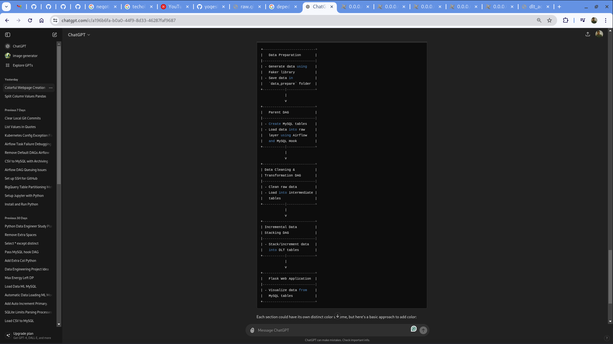

# Banking Data Processing Pipeline

## Overview

This project demonstrates a comprehensive data processing pipeline for 20 banking tables. The pipeline includes data generation, table creation, data loading, cleaning and transformation, incremental data stacking, and visualization using a Flask web application. The entire process is managed using Apache Airflow.

## Table of Contents

1. [Data Preparation](#data-preparation)
2. [Parent DAG for Table Creation and Data Loading](#parent-dag-for-table-creation-and-data-loading)
3. [Data Cleaning and Transformation DAG](#data-cleaning-and-transformation-dag)
4. [Incremental Data Stacking DAG](#incremental-data-stacking-dag)
5. [Flask Web Application](#flask-web-application)
6. [Running the Pipeline](#running-the-pipeline)
7. [Requirements](#requirements)
8. [Setup](#setup)


## Data Work flow Diagram


## Data Preparation

### Generating Data Using Faker

1. **Objective**: Generate synthetic data for 20 banking tables using the Faker library.

2. **Process**:
   - Define the schema for each table, specifying the required fields.
   - Use Faker to generate realistic data for each field.
   - Save the generated data as CSV files in the `data_prepare` folder for further processing.
    -   we have 2 types of data genration first is historical and second is todays 
we design 2 scripts for same i.e [dag_prepare_data_historic.py ](dag_prepare_data_historic.py)       
 [dag_prepare_data_today.py ](dag_prepare_data_today.py)
### Data Storage

1. **Objective**: Store the generated data in a designated folder for easy access by the Airflow DAGs.
2. **Process**:
   - Create a folder named `data_prepare` if it doesn't exist.
   - Save each table's data as a separate CSV file in the `data_prepare` folder.

## Parent DAG for Table Creation and Data Loading

### Objective

Control the creation of MySQL tables and loading of data into the raw layer using MySQL Hook in Airflow.

### Process

1. **Define the DAG**:
   - Set default arguments, including owner, start date, and retry settings.
   - Specify the schedule interval for the DAG.

2. **Task Definitions**:
   - Create a task for each table to load its data into MySQL.
   - Use PythonOperator to define tasks that execute a Python function to load data.

3. **Data Loading**:
   - Fetch data from CSV files.
   - Define MySQL table schemas based on the data types in the DataFrame.
   - Create tables if they do not exist.
   - Insert data into the tables.

4. **dag details**:
   - we created one parent dag i.e  [dag_parent.py ](dags/models/raw_models/dag_parent.py)
   - we define all 20 task from 20 table scripts and make them as subtask under the parent dag 
   - we given liner dependency for running each task.
   - will not take much time to run the task. but historical run will take much longer then expected as data is for whole year
## Data Cleaning and Transformation DAG


### Objective

Clean the data in the raw tables and load the cleaned data into intermediate tables.

### Process

1. **Define the DAG**:
   - Set default arguments, including owner, start date, and retry settings.
   - Specify the schedule interval for the DAG.

2. **Task Definitions**:
   - we craeted a common script that will clean all the tables data by looping them on it.
   - Use PythonOperator to define tasks that execute a Python function for data cleaning.

3. **Data Cleaning**:
   - Fetch raw data from MySQL tables.
   - Perform data cleaning operations, such as dropping rows with missing values strip_whitespace, empty_to_nan, drop_all_nan_columns,
    fill_na  ,    convert_all_to_datetime,      convert_all_to_numeric,      remove_duplicates,      normalize_column_names,      handle_outliers.
   - Create intermediate tables if they do not exist.
   - Insert cleaned data into the intermediate tables.

## Incremental Data Stacking DAG


### Objective

Stack or increment today's data from intermediate tables into DLT (Data Lake Table) tables.

### Process

1. **Define the DAG**:
   - Set default arguments, including owner, start date, and retry settings.
   - Specify the schedule interval for the DAG.

2. **Task Definitions**:
   - Create a task for each table to stack or increment its data.
   - Use PythonOperator to define tasks that execute a Python function for data stacking.

3. **Data Stacking**:
   - Fetch data from intermediate tables.
   - Create DLT tables if they do not exist.
   - Insert or append data into the DLT tables.

## Flask Web Application


### Objective

Visualize the processed data using a Flask web application.

### Process

1. **Set Up Flask**:
   - Create a Flask application with routes to display data from each table.
   - Define a function to fetch data from MySQL and render it as HTML tables.

2. **HTML Templates**:
   - Create HTML templates to display the data in a user-friendly format.
   - Use Jinja2 templating to dynamically generate content based on the data.

3. **Run the Application**:
   - Start the Flask application to serve the web pages.
   - Access the application through a web browser to view the data.

## Running the Pipeline


1. **Prepare Data**:
   - Run the data generation script to create synthetic data for the 20 banking tables.
   - Ensure the data is stored in the `data_prepare` folder.

2. **Run Parent DAG**:
   - Trigger the parent DAG in Airflow to create tables and load data into the raw layer.
   - Monitor the tasks to ensure data is loaded correctly.

3. **Run Data Cleaning and Transformation DAG**:
   - Trigger the data cleaning and transformation DAG to clean raw data and load it into intermediate tables.
   - Monitor the tasks to ensure data is cleaned and transformed correctly.

4. **Run Incremental Data Stacking DAG**:
   - Trigger the incremental data stacking DAG to stack or increment data from intermediate tables into DLT tables.
   - Monitor the tasks to ensure data is stacked correctly.

5. **Run Flask Application**:
   - Start the Flask application to serve the web pages.
   - Access the application through a web browser to view the processed data.

## Requirements

- Python 3.6+
- Apache Airflow
- Flask
- MySQL
- pandas
- Faker
- SQLAlchemy

## Setup

1. **Clone the Repository**:
   ```bash
   git clone https://github.com/yogeshmapari/bank_data_processing.git
   cd bank_data_processing
   ```
2. **Create a Virtual Environment and Install Dependencies:**

   ```bash
   python3 -m venv venv
   source venv/bin/activate
   pip install -r requirements.txt

3. **Install Dependencies**:
   ```bash
   pip install -r requirements.txt
   ```

4. **Set Up Airflow**:
   - Initialize the Airflow database:
     ```bash
     airflow db init
     ```
   - Start the Airflow web server and scheduler:
     ```bash
     airflow webserver --port 8080
     airflow scheduler
     ```

5. **Configure MySQL Connection**:
   - Set up a MySQL connection in Airflow with the connection ID `your_mysql_connection_id`.

6. **Generate Data**:
   - Run the data generation script to create synthetic data and save it in the `data_prepare` folder.

7. **Run Airflow DAGs**:
   - Trigger the parent DAG, data cleaning and transformation DAG, and incremental data stacking DAG in the Airflow UI.

8. **Start Flask Application**:
   - Run the Flask application to serve the web pages and visualize the data:
     ```bash
     flask run
     ```

## Challenges and Solutions

### Challenges:
- **Data variability**: Different formats and inconsistent data.
- **Performance**: Efficient processing of large datasets.
- **Integration**: Coordinating multiple data sources and systems.

### Solutions:
- **Data quality checks**: Ensuring data accuracy and consistency.
- **Optimization techniques**: Improving data processing performance.
- **Continuous improvement**: Regular updates and enhancements.

## Future Enhancements

### Planned Features:
- Implement live batch processing on local devices.
- Web scraping for stock data from the internet.
- Airflow-based batch processing.

### Advanced Analytics:
- Incorporate machine learning for predictive analysis.

### Real-Time Processing:
- Enable real-time data streaming and analysis.

### User Feedback:
- Iterate based on user interaction and requirements.

## Contribution

For contributions, feedback, or issues, please contact Yogesh Mapari at patilmapari@gmail.com.

## Blog

For more information, visit [this blog post](https://medium.com/@patilmapari/stock-data-processing-workflow-5426d1df9a33).


---

This documentation provides a structured approach to setting up and running the entire data processing pipeline. Each step is carefully designed to ensure data integrity, accuracy, and efficient processing, culminating in a user-friendly web interface for data visualization.
```

Make sure to adjust the connection ID and any other specific details according to your setup. This `README.md` file gives a clear and comprehensive guide for users to understand and run the data processing pipeline.